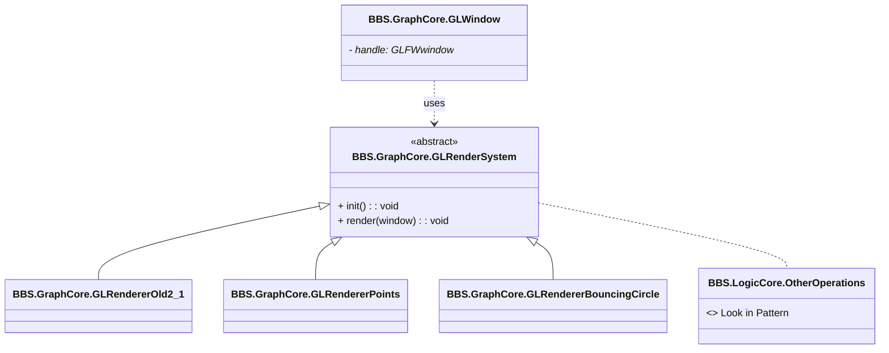

# Лабораторна робота 2  

## Звіт з лабороторної роботи №2  
За курсом "Обчислювальна геометрія та комп'юторна графіка"  
Студентки групи ПА-22-2  
Бобровицької Софії Сергіївни   
 
### 1. Постановка задачі:

  

  

  

### 2. Створення унікального імені графічного рушія

Був обраний простір імен BBS як абревіатура від імені: Bobrovytska Sofiia Serhiivna.

  

  

### 3. Основа коду на базі Task02Src

Було використано шаблон із Task02Src.
Код перенесено до Visual Studio 2022 з системою GLEW + GLFW. Створено власний рендерер з розширенням.

  
### 4. Діаграма UML

Було створено UML-діаграму у Mermaid-синтаксі, що ілюструє організацію просторів імен, структуру класів та спадкування:
GLRenderSystem (abstract)
GLRendererOld2_1, GLRendererPoints, GLRendererBouncingCircle
GLWindow використовує GLRenderSystem
Простір LogicCore зроблено як розширювання для логіки

### 5. Вивід до консолі

До main() додано основний вивід:

  

### 6. Створено 3 вікна

За допомогою GLWindow створено 3 незалежні вікна. Кожне отримує власний OpenGL-контекст.

### 7. Об'єкт VBO (GLRendererPoints)

Створено VAO/VBO, передані 3 точки, які відображаються через glDrawArrays(GL_POINTS)  

### 8. glDrawArrays()

### 9. Дві рендерні машини

У вікні 1: GLRendererPoints малює точки

У вікні 2: GLRendererOld2_1 малює обертовий трикутник (glBegin, glEnd)

У вікні 3: GLRendererBouncingCircle — реалізація кола, що рухається та відбивається

Усі 3 рендерери реалізують інтерфейс GLRenderSystem і викликаються через спільний API.  

### 10. Результат:

  

  

  

  

